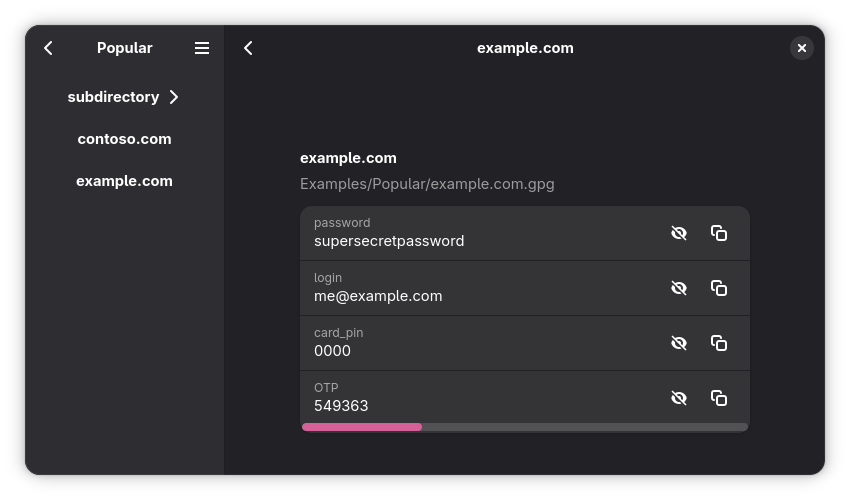

# Identities

A modern frontend for [`pass`](https://www.passwordstore.org/) built for GNOME.

## Features

 - Adaptive UI - works great on phones and small screens
 - Supports as many arbitrary attributes as you want
 - Generates TOTPs (even multiple per file)
 - Support for adding multiple password stores in arbitrary locations

## Download

You can get Identities both natively and as a Flatpak.

### Flatpak

There is not any official release *yet*. You can get the latest preview build as an artifact from [GitHub Actions](https://github.com/k8ieone/identities/actions/workflows/flatpak.yml).

Install it using `flatpak install identities.flatpak`.

Note: The Flatpak can be buggy - see [#32](https://github.com/k8ieone/identities/issues/32). If you're planning on using Identities I recommend using one of the native options below.

### Arch Linux

Available on the AUR! Install using you favorite [AUR helper](https://wiki.archlinux.org/title/AUR_helpers) or [install yourself](https://wiki.archlinux.org/title/Arch_User_Repository#Installing_and_upgrading_packages).

- [Stable package](https://aur.archlinux.org/packages/identities)
- [Development package](https://aur.archlinux.org/packages/identities-git)

### Alpine / postmarketOS

Available in Alpine Edge ([testing](https://pkgs.alpinelinux.org/packages?name=identities&branch=edge&repo=&arch=&origin=&flagged=&maintainer=) repository).

### Your distro!

Maintaining packages can be a challenge, so I truly appreciate any help! If you'd like to package Identities for your distribution, I'd love to have you involved.  
Feel free to open an issue / PR if you'd like to have your package listed here!

## Roadmap

See [issues](https://github.com/k8ieone/identities/issues) for more currently planned features.
